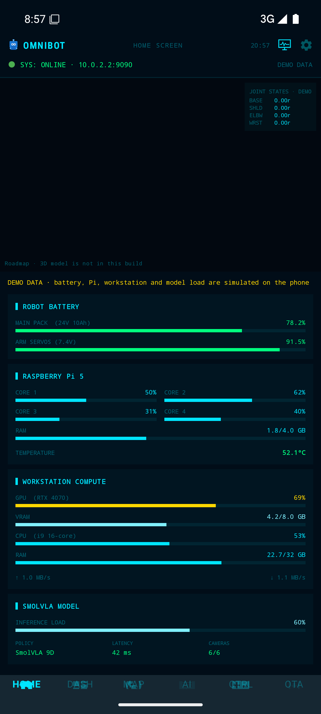
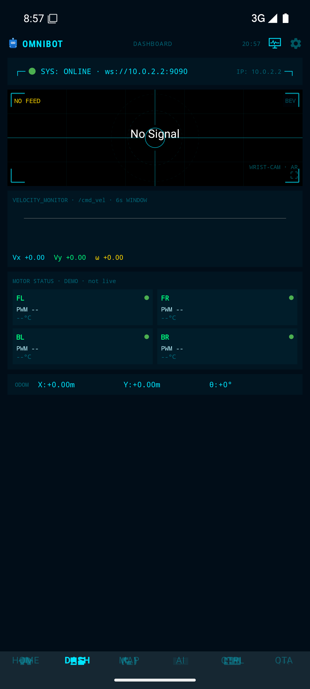
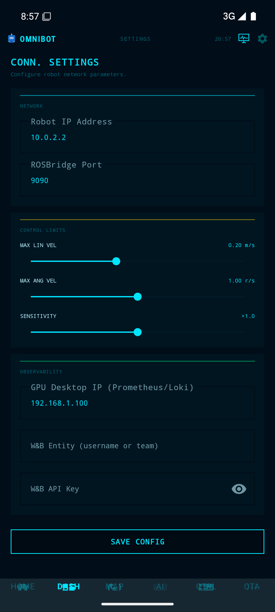

# OmniBot Android controller

Kotlin app that drives an OmniBot-style robot over a ROSBridge WebSocket. The Gradle project is this repository root (`settings.gradle.kts` includes `:app`). There is no `android_app/` directory.

Package `com.varunvaidhiya.robotcontrol`. Min SDK 24, compile and target SDK 35.

<p align="left">
  <a href="https://www.apache.org/licenses/LICENSE-2.0"></a>
  
  
  
</p>

The license badge matches `LICENSE` (Apache-2.0). CI runs `./gradlew assembleDebug test` and uploads `app-debug.apk` on each run (see `.github/workflows/android-ci.yml`).

## What is real in this build

| What you see | What the code does |
|---|---|
| Settings IP and port | Saved in DataStore. On launch, and again when you tap SAVE CONFIG, `MainViewModel` calls `RobotRepository.connect`, which opens `ws://<ip>:<port>` (cleartext, not TLS). |
| Connection dot | Green / amber / red from the ROSBridge socket state. |
| Home battery, Pi, workstation, and model cards | **Demo data.** `HomeFragment` advances them on a timer. They are not `/diagnostics` and not a detected hardware inventory. The screen says so. |
| Home joint readout and empty 3D pane | Placeholders. `robot.glb` is not in this repo, and this screen does not load one. |
| Dashboard camera | MJPEG from `http://<robot-ip>:8080/stream?topic=/camera/front/image_raw` only after the socket reports connected. The badge stays **NO FEED** until a JPEG frame arrives. |
| Dashboard chart and odometry | Values from `/odom` after a connection. Zeros until then. The motor tiles are labelled DEMO and are not wheel telemetry. |
| Map, point cloud, 3D robot viewer | Views subscribe to `/map`, `/camera/depth/points`, `/odom`, and `/arm/joint_states`. The 3D tab looks for `robot.glb` in assets and shows a missing-model state when it is absent. |
| AI chat | Sends text on `/ai/command` or `/mission/command` only while the socket is connected. The face animation (idle / processing / speaking) is a local timer, not a robot reply. |
| Controls | Joystick and arm sliders publish `/cmd_vel/teleop`, `/control_mode`, and `/arm/joint_commands` when connected. |
| Observability | HTTP clients for Prometheus, Loki, Alertmanager, and W&B, using the GPU IP and W&B fields from Settings. Empty when those services are not reachable. |
| OTA | Calls ROS services `/ota/check`, `/ota/apply_workspace`, `/ota/apply_models`, and `/ota/rollback_workspace` when connected. |

ROS topic names live in `app/src/main/kotlin/com/varunvaidhiya/robotcontrol/utils/Constants.kt`.

## Roadmap

Not in this repository, and not claimed as working here:

- TLS (`wss://`) for ROSBridge. The manifest allows cleartext traffic.
- A checked-in `robot.glb`, URDF, or `tools/urdf_to_glb.py`.
- Robot-side nodes (`rosbridge`, `web_video_server`, Nav2, camera, arm, OTA, Loki). This app only speaks to them.
- Home metrics fed by real diagnostics.
- Instrumented UI tests. Unit tests are `app/src/test` only.

## Screenshots

API 35 emulator, no robot. The socket shows online because a WebSocket listener on the host accepted `ws://10.0.2.2:9090`. Home metrics are labelled demo data. The camera has no frame.







## Navigation

`MainActivity` hosts `res/navigation/mobile_navigation.xml`.

Bottom bar (six items; `OmniBottomNavigationView` raises the Material limit of five):

- Home
- Dashboard
- Map (ViewPager: 2D SLAM, point cloud, 3D robot)
- AI
- Controls
- OTA

The top bar, not the bottom bar, opens Settings and Observability.

`ui/logs/LogsFragment.kt` is not a navigation destination. The logs page that is on screen is `ui/observability/logs/`.

## Repository layout

```
.
├── .github/workflows/android-ci.yml
├── app/
│   ├── build.gradle.kts
│   └── src/
│       ├── main/
│       │   ├── AndroidManifest.xml
│       │   ├── kotlin/com/varunvaidhiya/robotcontrol/
│       │   │   ├── MainActivity.kt
│       │   │   ├── RobotApplication.kt
│       │   │   ├── di/NetworkModule.kt
│       │   │   ├── data/models/
│       │   │   ├── data/preferences/AppPreferences.kt
│       │   │   ├── data/remote/          # Prometheus, Loki, Alertmanager, W&B
│       │   │   ├── data/repository/      # RobotRepository, ObservabilityRepository
│       │   │   ├── network/              # ROSBridgeManager
│       │   │   ├── utils/Constants.kt
│       │   │   └── ui/                   # home, dashboard, mapping, slam, viewer,
│       │   │                             # ai, controls, observability, ota, settings, views
│       │   └── res/                      # layout, drawable, navigation, values
│       └── test/                         # JVM unit tests
├── build.gradle.kts
├── gradle/wrapper/
├── gradlew
├── settings.gradle.kts                   # rootProject.name = RobotControl
├── robot_app_prompt.md                   # original build notes, not a status report
└── README.md
```

There is no `app/src/main/assets/` directory in git.

## Build

| Tool | Version used here |
|---|---|
| JDK | 17 (CI). JDK 21 also runs this Android Gradle Plugin. |
| Android Gradle Plugin | 8.13.2 |
| Gradle | 8.13 (wrapper) |
| Kotlin | 2.1.0 |
| Compile / target SDK | 35 |
| Min SDK | 24 |

```bash
# from this repository root, with ANDROID_HOME or local.properties sdk.dir set
./gradlew assembleDebug test
./gradlew installDebug
```

`local.properties` is gitignored. Debug APK output: `app/build/outputs/apk/debug/app-debug.apk`.

On a robot network, run your own `rosbridge` on port 9090 and, for the camera, `web_video_server` on port 8080. Those processes are not in this repo. The default address in the app is `192.168.1.100:9090`. From an Android emulator, the host machine is `10.0.2.2`.

## License

Apache License 2.0. The `LICENSE` file for this repository is added in the OHH-18 pull request. Third-party libraries are Gradle dependencies (not vendored sources) and keep their own licenses.
